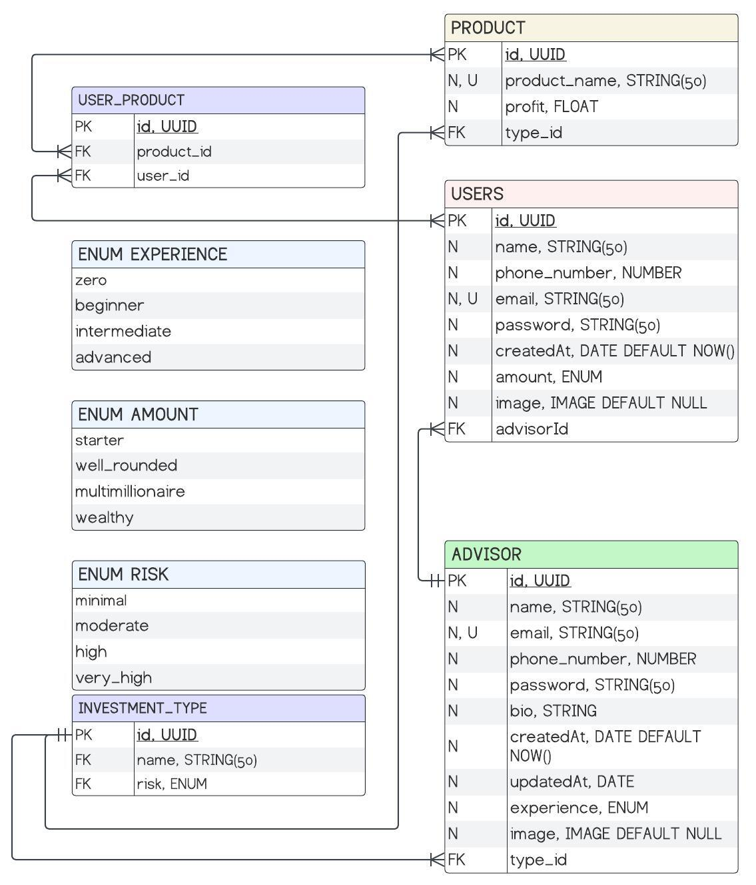

# Backend for a Fullstack project

## Descrição

Backend em NestJS utilizando Prisma e Postgresql para uma aplicação que
vincula investidores com assessores de investimento.

## Autor

Bruno Moleta Santos

## Relacionamentos



## Versão

1.0.0

## Tecnologias Utilizadas

<div style="display: flex;">
  
  
  
  
  

</div>

## Scripts

- `build`: Compilação do projeto Nest.js.
- `format`: Formatação do código usando Prettier.
- `start`: Inicia o servidor Nest.js.
- `start:dev`: Inicia o servidor em modo de desenvolvimento com monitoramento de alterações.
- `start:debug`: Inicia o servidor em modo de depuração com monitoramento de alterações.
- `start:prod`: Inicia o servidor em modo de produção.
- `lint`: Executa o ESLint para linting e correção automática.

Execute os scripts utilizando `npm run` ou `yarn run`.

## Dependências

- @nestjs/common: ^10.0.0,
- @nestjs/core: ^10.0.0,
- @nestjs/jwt: ^10.2.0,
- @nestjs/passport: ^10.0.3,
- @nestjs/platform-express: ^10.0.0,
- @nestjs/swagger: ^7.2.0,
- @prisma/client: ^5.9.0,
- @types/multer: ^1.4.11,
- bcryptjs: ^2.4.3,
- class-transformer: ^0.5.1,
- class-validator: ^0.14.1,
- cloudinary: ^2.0.1,
- cors: ^2.8.5,
- dotenv: ^16.4.1,
- jsonwebtoken: ^9.0.2,
- multer: ^1.4.5-lts.1,
- passport: ^0.7.0,
- passport-jwt: ^4.0.1,
- pg: ^8.11.3,
- prisma: ^5.9.0,
- reflect-metadata: ^0.1.13,
- rxjs: ^7.8.1,
- swagger-ui-express: ^5.0.0

## Dependências de Desenvolvimento

- @nestjs/cli: ^10.0.0,
- @nestjs/schematics: ^10.0.0,
- @nestjs/testing: ^10.0.0,
- @swc/cli: ^0.1.65,
- @swc/core: ^1.3.105,
- @types/bcryptjs: ^2.4.6,
- @types/express: ^4.17.17,
- @types/jest: ^29.5.2,
- @types/node: ^20.3.1,
- @types/passport-jwt: ^4.0.1,
- @types/supertest: ^6.0.0,
- @typescript-eslint/eslint-plugin: ^6.0.0,
- @typescript-eslint/parser: ^6.0.0,
- eslint: ^8.42.0,
- eslint-config-prettier: ^9.0.0,
- eslint-plugin-prettier: ^5.0.0,
- jest: ^29.5.0,
- nodemon: ^3.0.3,
- prettier: ^3.0.0,
- source-map-support: ^0.5.21,
- supertest: ^6.3.3,
- ts-jest: ^29.1.0,
- ts-loader: ^9.4.3,
- ts-node: ^10.9.1,
- tsconfig-paths: ^4.2.0,
- typescript: ^5.1."

## Instalação

1. Clone o repositório:

```bash
git clone git@github.com:brunomoleta/Investment-app-client.git
```

2. Instale as dependências:

```bash
yarn install
```

## Configuração do Ambiente

Certifique-se de configurar as variáveis de ambiente necessárias no arquivo `.env`, usando com base o `.env.example`,
localizado na raiz do projeto.

## Configuração do Banco de Dados

1. Instalação do PostgreSQL

Certifique-se de ter o PostgreSQL instalado em seu sistema. Você pode baixá-lo
em [https://www.postgresql.org/download/](https://www.postgresql.org/download/).

2. Inicialização do Serviço

Após a instalação, inicie o serviço do PostgreSQL. Os comandos podem variar de acordo com o sistema operacional, mas
geralmente incluem:

- **Linux:**

```bash
sudo service postgresql start
```

- **Windows:**

Vá para o "Painel de Controle" > "Ferramentas Administrativas" > "Serviços".
Localize o serviço PostgreSQL e inicie-o.

- **MacOS:**

```bash
pg_ctl -D /usr/local/var/postgres start
```

3. Acesso ao Banco de Dados

Por padrão, o PostgreSQL cria um banco de dados chamado postgres. Você pode acessá-lo usando o utilitário psql no
terminal:

```bash
psql -U postgres
```

Isso abrirá uma sessão interativa com o banco de dados postgres usando o usuário postgres. Você pode ser solicitado a
fornecer a senha.

4. Criar um Novo Banco de Dados

Dentro do shell psql, execute o seguinte comando para criar um novo banco de dados:

```bash
CREATE DATABASE nome_do_banco_de_dados;
```

Substitua `nome_do_banco_de_dados` pelo nome desejado para o seu banco de dados.

5. Execute as migrações do Prisma

```bash
prisma migrate dev
```

## Executando o Projeto

Execute o seguinte comando para iniciar o servidor:

```bash
# development
$ yarn start

# watch mode
$ yarn run start:dev

# production mode
$ yarn run start:prod
```

O servidor local estará acessível em [http://localhost:3001](http://localhost:3000).
Observação: A porta poderá ser diferente caso tenha configurado de outra forma no `.env`.

## Estrutura do Projeto

A estrutura foi toda baseada em NestJS e desenvolvida com TypeScript e elementos de Programação Orientada a Objetos.
Abaixo o detalhamento da estrutura:

- `module`: tem a função de organizar e encapsular componentes relacionados, como controllers, services e providers.
- `service`: responsável por executar interagir com o banco de dados e fornecer funcionalidades específicas para os
  controllers ou outros services.
- `controller`: responsável por lidar com a entrada de solicitações do cliente, como GET, POST, PATCH e DELETE.
- `entity`: refere-se ao modelo de dados que representa as tabelas do banco de dados.
- `dto`: tem como objetivo transferir dados entre os controllers e os services.

## Endpoints

A documentação completa encontra-se em [deploy-swagger](https://investment-fullstack.onrender.com/doc)(deploy)
ou [local-swagger](http://localhost:3001/doc)(se rodando localmente).


| `Método`   | `Endpoint`                            | `Responsabilidade`                                   | `Autenticação`        |
|------------|---------------------------------------|------------------------------------------------------|-----------------------|
| POST       | /session/admin                        | Gera o token de autenticação de admin                | Acesso universal      |
| POST       | /session/advisor                      | Gera o token de autenticação de assessor             | Acesso universal      |
| POST       | /session/investor                     | Gera o token de autenticação de investidor           | Acesso universal      |
| ---------- | -------------------------------       | --------------------------------------------         | --------------------- |
| POST       | /investor                             | Cadastro de investidor                               | Acesso universal      |
| GET        | /investor                             | Lista todos os investidores                          | Usuário autenticado   |
| GET        | /investor/id                          | Lista investidor por Token                           | Usuário autenticado   |
| GET        | /investor/advisor/:advisor_id         | Filtra investidores por assessor                     | Usuário autenticado   |
| GET        | /investor/amount/:amount              | Filtra investidores por capital($)                   | Usuário autenticado   |
| PATCH      | /investor                             | Altera dados do investidor pelo Token                | Usuário autenticado   |
| PATCH      | /investor/password                    | Valida a senha atual e substitui por uma nova        | Usuário autenticado   |
| DELETE     | /investor                             | Exclui investidor pelo Token                         | Usuário autenticado   |
| ---------- | -------------------------------       | --------------------------------------------         | --------------------- |
| POST       | /advisor                              | Cria um assessor                                     | Acesso universal      |
| GET        | /advisor                              | Lista assessores                                     | Acesso universal      |
| GET        | /advisor/all                          | Lista assessores com mais informações                | Usuário autenticado   |
| GET        | /advisor/speciality_id/:speciality_id | Filtra assessores através do Id da especialidade     | Acesso universal      |
| GET        | /advisor/experience/:experience       | Filtra assessores através da experiência             | Acesso universal      |
| GET        | /advisor/id                           | Lista assessor através do token                      | Usuário autenticado   |
| PATCH      | /advisor                              | Atualiza assessor através do token                   | Usuário autenticado   |
| PATCH      | /advisor/password                     | Valida a senha atual e substitui por uma nova        | Usuário autenticado   |
| DELETE     | /advisor                              | Remove assesor através do token                      | Usuário autenticado   |
| ---------- | -------------------------------       | --------------------------------------------         | --------------------- |
| POST       | /investment_type                      | Cria categoria de investimento                       | Usuário autenticado   |
| GET        | /investment_type/all                  | Lista categorias de investimento com info completa   | Usuário autenticado   |
| GET        | /investment_type                      | Lista categorias de investimento                     | Acesso universal      |
| GET        | /investment_type/risk/:risk           | Filtra categorias de investimento por nível de risco | Acesso universal      |
| GET        | /investment_type/id/:id               | Lista categoria de investimento através de id        | Acesso universal      |
| PATCH      | /investment_type                      | Altera categoria de investimento                     | Usuário autenticado   |
| ---------- | -------------------------------       | --------------------------------------------         | --------------------- |
| POST       | /admin                                | Cria administrador                                   | Usuário autenticado   |
| GET        | /admin                                | Lista administradores                                | Usuário autenticado   |
| GET        | /admin/id                             | Lista admin através do Token                         | Usuário autenticado   |
| PATCH      | /admin/password                       | Valida a senha atual e substitui por uma nova        | Usuário autenticado   |
| DELETE     | /admin                                | Remove administrador                                 | Usuário autenticado   |

## Deploy

Para testar a aplicação em produção, utilize: [investing-back-end](https://investment-fullstack.onrender.com).

## Contato

Para questionamentos ou sugestões, entre em contato através do email: brunomoleta@pm.me.
Será um prazer respondê-lo.
